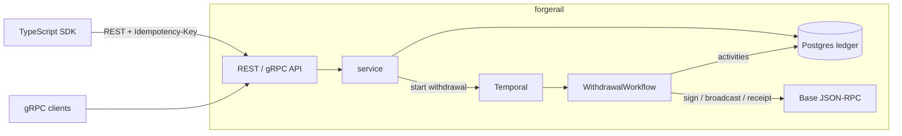

# ForgeRail

A USDC settlement platform in Go: an idempotent double-entry ledger on
PostgreSQL, gRPC and REST APIs, Temporal workflows that settle withdrawals on
[Base](https://base.org), and a small TypeScript SDK.

The main thing this project is about is **retries not moving money twice**.
Clients time out, workers crash, RPC nodes drop requests after accepting them.
Every layer here is built so that doing something again is safe.

> Side project, not production software. It runs against Base Sepolia
> (testnet) and has no auth. See [known limitations](#known-limitations).

## How it fits together



### Money movement

Everything is a **transfer**, and a transfer posts balanced debit/credit
pairs of **entries**. Each pair is tagged with a **phase**:

| transfer | phase | debit | credit | status after |
|---|---|---|---|---|
| internal | `post` | sender | receiver | `posted` |
| withdrawal | `hold` | sender | `sys_settlement` | `pending` |
| withdrawal | `settle` | `sys_settlement` | `sys_onchain_out` | `settled` |
| withdrawal | `release` | `sys_settlement` | sender | `failed` |

Deposits come in as internal transfers from `sys_onchain_in`, the only
account allowed to go negative. Because every posting is balanced, all
balances always sum to zero, and the replay tool checks that.

Amounts are `int64` micro-USDC (USDC has 6 decimals). No floats anywhere.

### Where idempotency comes from

1. **API key.** `POST /v1/transfers` requires an `Idempotency-Key`. The first
   request stores the key plus a hash of the body. Replays return the original
   transfer (`200` + `Idempotent-Replayed: true`). Same key with a different
   body is a `409`.
2. **Entries.** `UNIQUE (transfer_id, phase, direction)` on `entries` means a
   phase can only ever be posted once. `Settle` / `Release` can be called any
   number of times, and only the first one moves money.
3. **Row locks in a fixed order.** Every balance change locks its account
   rows `FOR UPDATE` sorted by id, so concurrent transfers can't deadlock or
   overdraw. A `CHECK (allow_negative OR balance >= 0)` backs it up.
4. **Workflow id = transfer id.** Starting settlement twice attaches to the
   same Temporal run, so the API can safely re-kick settlement on every
   retried request (which also heals a crash between "hold posted" and
   "workflow started").
5. **Sign, persist, then broadcast.** The withdrawal workflow signs the tx
   first, stores its hash, then broadcasts. The signed bytes live in workflow
   history, so a retry re-broadcasts the *same* transaction (same nonce, same
   hash) instead of creating a new one.

### Withdrawal workflow

```
load -> sign tx -> mark submitted (hash) -> broadcast -> wait for receipt -> settle
          |                                                  |
          | permanent error                                  | reverted / never seen
          v                                                  v
        release                                            release
```

If the receipt state is unknown (e.g. the RPC is down for longer than the
retry policy) the workflow fails **without** releasing and the transfer stays
`submitted`. Guessing wrong there would either lose money or pay twice.

## Running it

Needs Go 1.25+. Postgres, Temporal and Base are all optional.

**Everything in memory** (memory store, fake chain, in-process settlement):

```sh
go run ./cmd/forgerail -dev
```

**With Postgres** (either one works):

```sh
./scripts/dev-postgres.sh start   # Homebrew/apt Postgres, no Docker, port 55432
docker compose up -d postgres     # or Docker

export DATABASE_URL="postgres://postgres@localhost:55432/forgerail?sslmode=disable"
go run ./cmd/forgerail -dev
```

The server migrates the schema on startup.

**With Temporal:**

```sh
brew install temporal && temporal server start-dev   # or: docker compose up -d
export FORGERAIL_TEMPORAL_ADDR=localhost:7233
go run ./cmd/forgerail -dev                          # also runs the worker
```

The Temporal UI is at http://localhost:8233; every withdrawal shows up as a
`withdrawal-<transfer id>` workflow.

Without `FORGERAIL_TEMPORAL_ADDR` withdrawals are settled by `LocalRunner`,
which runs the same activities in a goroutine. Handy for dev, but not durable.

**On Base Sepolia:** fund a throwaway wallet with Sepolia ETH and test USDC,
then:

```sh
export FORGERAIL_CHAIN=base
export FORGERAIL_HOT_WALLET_KEY=<hex private key, testnet only>
# defaults: https://sepolia.base.org, chain id 84532, Circle's Sepolia USDC
go run ./cmd/forgerail -dev
```

`-dev` allows transfers out of `sys_*` accounts, which is how you fund test
accounts. Without it those requests get a `403`.

### Try it

```sh
A=$(curl -s -XPOST localhost:8080/v1/accounts -d '{"name":"alice"}' | jq -r .id)

# fund (dev mode only)
curl -s -XPOST localhost:8080/v1/transfers -H 'Idempotency-Key: fund-1' \
  -d "{\"kind\":\"internal\",\"from_account_id\":\"sys_onchain_in\",\"to_account_id\":\"$A\",\"amount\":\"100\"}"

# withdraw to Base, run it twice: same transfer comes back, money moves once
for i in 1 2; do
  curl -s -XPOST localhost:8080/v1/transfers -H 'Idempotency-Key: wd-1' \
    -d "{\"kind\":\"withdrawal\",\"from_account_id\":\"$A\",\"destination_address\":\"0x1111111111111111111111111111111111111111\",\"amount\":\"25.50\"}" | jq '{id,status}'
done

curl -s localhost:8080/v1/accounts/$A | jq .balance    # "74.500000"
```

gRPC is on `:9090` with reflection enabled, so
`grpcurl -plaintext localhost:9090 list` works. The REST contract is in
[`api/openapi.yaml`](api/openapi.yaml) (also served at `/openapi.yaml`) and
the SDK is in [`sdk/typescript`](sdk/typescript).

## Testing

```sh
make test              # unit tests, memory store, Temporal test env
make db-up test-db     # + the Postgres conformance suite
FORGERAIL_TEST_TEMPORAL_ADDR=localhost:7233 go test ./internal/settlement/   # + real Temporal server
cd sdk/typescript && npm ci && npm test
```

- `internal/ledger/ledgertest` is a conformance suite that both stores run:
  replays, key reuse, insufficient funds, the withdrawal lifecycle, 25
  concurrent requests with one key, 40 concurrent transfers racing to overdraw
  one account.
- `internal/settlement` runs the workflow in Temporal's test environment
  against the real activities with a fake chain that fails broadcasts
  (including *after* accepting the tx) and reverts transactions.
- `internal/settlement/temporal_integration_test.go` runs against a real
  Temporal server: 20 concurrent starts for one withdrawal attach to a single
  run, starting it again after it finished doesn't create a new run, and
  retried API requests through the service layer settle exactly once. CI runs
  these against the Temporal dev server.
- `internal/httpapi/contract_test.go` fails if the routes or JSON fields drift
  from `openapi.yaml`.

### Replay: 100,000 transfers under retries

`cmd/replay` generates a seeded batch of transfers and sends them the way
flaky clients do: duplicates (half of them raced concurrently), first
attempts cancelled mid-flight and retried, and settle/release called several
times like retried activities. Then it checks the database.

```sh
go run ./cmd/replay -database-url "$DATABASE_URL" -reset -n 100000
```

Measured on an Apple M5 Pro with local Postgres 14, 64 workers, 500 accounts:

```
sent 180086 CreateTransfer calls for 100000 transfers in 15.33s (6523 transfers/s)
  74918 duplicate sends (15167 transfers raced concurrently), 5168 first attempts cancelled mid-flight
  36324 settle/release/mark-submitted calls, 0 transient errors retried

checks
  [ok  ] balances match the plan                0 accounts drifted, total 0.000000 USDC
  [ok  ] every key stored exactly once          100000/100000
  [ok  ] duplicate debits                       0
  [ok  ] debits per transfer as expected        0 transfers off
  [ok  ] balances match entries (drift)         0 accounts
  [ok  ] ledger sums to zero                    sum = 0.000000
```

### Load test through Temporal with injected failures

`cmd/loadgen` drives the REST API at a fixed rate and retries 5xx/timeouts
with the same idempotency key. Every withdrawal is settled by its own
`WithdrawalWorkflow` on a Temporal server. The server was started with chaos
turned on: 2% of transfer requests fail before they're handled, 5% are handled
and then the response is thrown away (the nasty case), and the fake chain
fails 20% of broadcasts and reverts 5% of transactions.

```sh
temporal server start-dev
go run ./cmd/forgerail -dev -database-url "$DATABASE_URL" -temporal-addr localhost:7233 \
  -fake-broadcast-fail-rate 0.2 -fake-revert-rate 0.05 -fake-confirm-after 300ms \
  -chaos-error-rate 0.02 -chaos-lost-response-rate 0.05
go run ./cmd/loadgen -rps 400 -duration 60s
```

Everything on one laptop (Apple M5 Pro): API, worker, Postgres 14 and the
Temporal 1.32 dev server (in-memory).

```
load:        23992 requests in 1m0.006s, 23992 succeeded = 399.8 successful transfers/s (target 400)
latency:     p50 900µs  p95 34.4ms  p99 50.2ms  max 1.37s  (end to end, including retries)
attempts:    25754 total, 1762 retried, 1762 5xx, 0 4xx, 0 network errors
replays:     1188 retries hit a transfer that had already committed (lost response)
gave up:     0 requests failed after 6 retries
outcomes:    19184 internal posted, 4573 withdrawals settled, 235 withdrawals failed+released, 0 rejected, 0 still in flight
settlement:  withdrawal created -> settled/failed p50 621ms  p95 2.71s  p99 5.64s  max 1m4.09s
backlog:     98 withdrawals finished after the load stopped, the last one 59.7s after
balances:    0 of 200 accounts differ from what the API responses imply
```

`temporal workflow count` before and after the run: 4,808 new
`WithdrawalWorkflow` runs (one per withdrawal), all completed, none failed.

How to read the settlement numbers:

- The median stayed at 0.61–0.63s in every 10-second window of the run, so
  settlement kept up with ~80 new workflows a second instead of building a
  queue. Most of that 0.6s is the fake chain's 300 ms confirmation time.
- The tail is the injected broadcast failures. Temporal retries `Broadcast`
  with 1s, 2s, 4s, ... backoff, so one failure costs ~1s and the 64s outlier
  is a broadcast that failed six times in a row before attempt 7 went
  through.
- With the SDK default of 2 pollers per task type, the worker had occasional
  ~4s gaps between back-to-back activities late in the run (p95 3.4s).
  `-worker-pollers` now defaults to 8, which kept the sampled dispatch gap
  under 100 ms.

With in-process settlement instead of Temporal (`LocalRunner`), the same
setup also held 400 req/s for 60s, and 1,500 req/s for 20s (30,000/30,000,
no balance drift). Temporal on a laptop wasn't pushed past 400.

## Layout

```
api/                 OpenAPI spec (embedded into the binary)
cmd/forgerail        server: REST :8080, gRPC :9090, optional Temporal worker
cmd/replay           replay harness + ledger invariant checks
cmd/loadgen          open-loop load generator
gen/forgerail/v1     generated protobuf/gRPC code (make proto)
internal/chain       Base client (go-ethereum) and the fake chain
internal/grpcapi     gRPC server
internal/httpapi     REST handlers, contract test, chaos middleware
internal/ledger      domain types, Store interface, memory store, conformance suite
internal/money       micro-USDC amount type
internal/pgstore     Postgres store and migrations runner
internal/service     rules shared by both APIs
internal/settlement  Temporal workflow, activities, LocalRunner
migrations/          SQL schema
proto/               protobuf definitions
sdk/typescript       TypeScript SDK
```

## Known limitations

- **One hot wallet, nonces tracked in memory.** Only run one instance per
  wallet. A signed tx that is never broadcast burns its nonce and blocks the
  ones after it.
- **"Never seen on chain" releases the hold.** If a tx really was dropped
  that's right, but if it shows up after `MaxWait` the user has been refunded
  *and* paid. A real system would replace the nonce with a cancel tx before
  releasing.
- **Hot system rows.** Every withdrawal touches `sys_settlement`, so they
  serialize on that row. Fine at this scale; sharded system accounts would fix
  it.
- **No deposits watcher.** Deposits are simulated with transfers out of
  `sys_onchain_in` in dev mode.
- **No auth, no rate limiting, no metrics.** Logs only.

## License

MIT
